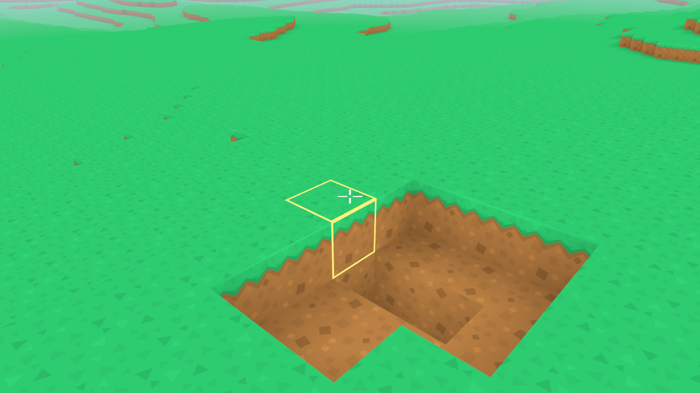

# Voxel Renderer

A hobbyist Vulkan renderer written in modern C++.

The current application renders chunked voxel terrain, but the larger goal is to build a
small rendering framework for application defined graphics. The project includes custom
Vulkan resource management, threaded chunk meshing, support for texture arrays,
and basic voxel interaction.

This is an engine/rendering project rather than a complete game.


## Features

### Application

* Randomized voxel terrain generation
* Mouse and keyboard camera controls
* Chunk meshes generated and streamed to the GPU as the camera moves through the world
* Multithreaded mesh generation with read/write views and thread safe queues
* Block selection, highlighting and removal
* Semi-persistent terrain modification
* Texture array based block face materials
* Hidden face culling across chunk boundaries
* Frustum culling
* Basic voxel ambient occlusion



### Rendering Framework

* Application facing renderer API for creating meshes, textures, materials, pipelines, and shader data
* Vulkan renderer with swapchain recreation, depth buffering, MSAA color resolve, and dynamic rendering
* Asynchronous GPU uploads using a persistently mapped staging ring buffer, transient command buffers, fences, and
  completion callbacks
* Device local mesh buffer with custom suballocation for vertex and index data
* Deferred resource deletion so meshes, pipelines, and shader data are not freed while still used by in flight frames
* Per frame shader data allocator using Vulkan buffer device addresses
* Push constants used to pass GPU addresses for application defined shader structs
* Texture array support with GPU mipmap generation and anisotropic sampling
* Pipeline cache/manager for application defined graphics pipelines

## Controls

* WASD: Move
* Mouse: Look
* Left click: Remove block

## Building

### Requirements:

- Clang 20+
- libstdc++ 14+ (or another C++23 compatible standard library)
- CMake
- Ninja
- pkg-config
- Vulkan development libraries
- X11 development libraries
- Wayland development libraries
- glslc (GLSL Shader Compiler)

### Install dependencies (Ubuntu / Debian)

```bash
apt update

apt install -y \
clang-20 \
libstdc++-14-dev \
cmake \
ninja-build \
pkg-config \
libx11-dev \
libxrandr-dev \
libxinerama-dev \
libxcursor-dev \
libxi-dev \
libwayland-dev \
libxkbcommon-dev \
libgl1-mesa-dev \
libvulkan-dev \
glslc
```

### Configure:

```bash
cmake -S . -B build -G Ninja \
-DCMAKE_C_COMPILER=clang-20 \
-DCMAKE_CXX_COMPILER=clang++-20
```

### Build:

```bash
cmake --build build
```

## Assets

Blockgame uses the Kenney Voxel Pack for textures.

1. Download the asset pack:
   https://www.kenney.nl/assets/voxel-pack
2. Extract the archive.
3. Copy the directory: `kenney_voxel-pack/PNG/Tiles`
4. Create the directory: `blockgame/BlockGame/Textures`
5. Place the `Tiles` folder inside it.
6. The final structure should look like:

```
blockgame/
└── BlockGame/
    └── Textures/
        └── Tiles/
            ├── brick_grey.png
            ├── brick_red.png
            └── ...
```

