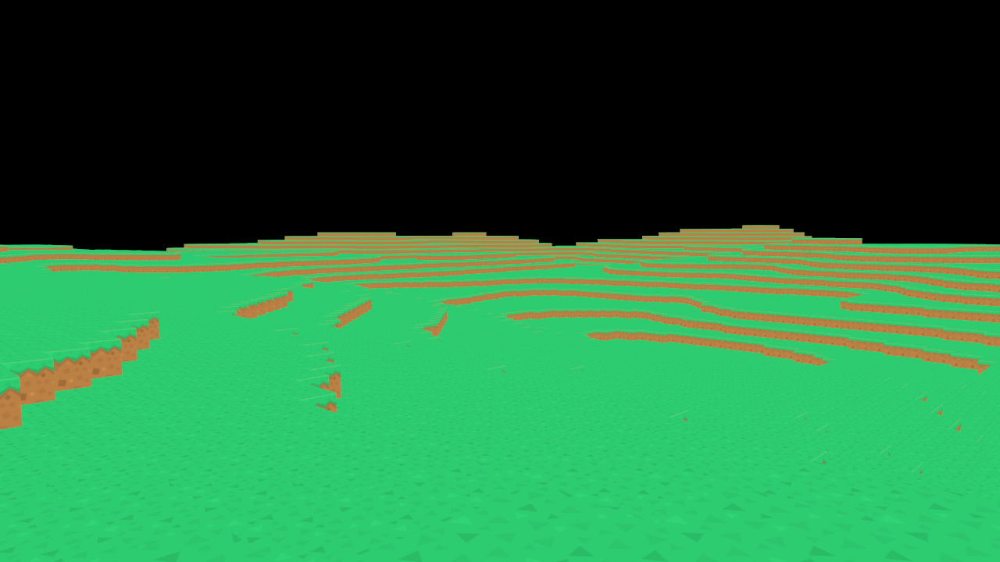

# Blockgame

A voxel-based game engine and application built in modern C++ using Vulkan for rendering.



## Building

### Requirements:

- Clang 20+
- libstdc++ 14+ (or another C++23 compatible standard library)
- CMake
- Ninja
- pkg-config
- Vulkan development libraries
- X11 development libraries
- Wayland development libraries
- glslc (GLSL Shader Compiler)

### Install dependencies (Ubuntu / Debian)

```bash
apt update

apt install -y \
clang-20 \
libstdc++-14-dev \
cmake \
ninja-build \
pkg-config \
libx11-dev \
libxrandr-dev \
libxinerama-dev \
libxcursor-dev \
libxi-dev \
libwayland-dev \
libxkbcommon-dev \
libgl1-mesa-dev \
libvulkan-dev \
glslc
```

### Configure:

```bash
cmake -S . -B build -G Ninja \
-DCMAKE_C_COMPILER=clang-20 \
-DCMAKE_CXX_COMPILER=clang++-20
```

### Build:

```bash
cmake --build build
```

## Assets

Blockgame uses the Kenney Voxel Pack for textures.

1. Download the asset pack:
   https://www.kenney.nl/assets/voxel-pack
2. Extract the archive.
3. Copy the directory: `kenney_voxel-pack/PNG/Tiles`
4. Create the directory: `blockgame/Blockgame/Textures`
5. Place the `Tiles` folder inside it.
6. The final structure should look like:

```
blockgame/
└── BlockGame/
    └── Textures/
        └── Tiles/
            ├── brick_grey.png
            ├── brick_red.png
            └── ...
```

